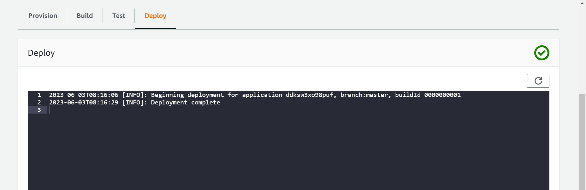

1. Search any publicly available Next.js sample application. This can be any static site build
with Next.js. Backend is not really required.
2. Clone this application code from step 1 in your GitHub repository.
3. Deploy this application on AWS Amplify.
a. Provision Amplify infrastructure using terraform.
b. Setup CI/CD pipeline with Amplify’s inbuilt functionality.
4. Create a detailed README file of the steps you followed for this setup.
5. Submit the deployed application url and a link to your repository with a README file in it
to HR Team.


Solution:
---------
* To achieve the above we need to do it manually First. For that we need a opensource next.js application for that i  have taken an opensource next.js application.
* Github url: https://github.com/Kiranteja623/nextjs-s3-upload.git
* I have forked the repository  and cloned the repository to an ec2 machine.
 
* The manual commands are
  
```
sudo apt update
sudo apt install  nodejs npm -y
git clone https://github.com/Kiranteja623/nextjs-s3-upload.git
ls
cd nextjs-s3-upload/
npm i
npm run dev

```

* Now check  the output using http://localhost:3000
  
  
* Now we have to write a terraform template to create the infrastructure in AWS.
* The files for Terraform are created in Terraform files folder.
* Now Go to the console and check whether the resource is created or not.
  
  
  
  

Creation of backend through AWS Amplify cli:
---------------------------------------------
* For this we have to take a ec2 instance and install aws cli and aws amplify in it.
* So we take the EC2 and install aws cli using the following commands.
```
curl "https://awscli.amazonaws.com/awscli-exe-linux-x86_64.zip" -o "awscliv2.zip"
unzip awscliv2.zip
sudo ./aws/install

```
* Then use aws configure and enter the access key and secret key.
* after that install nodejs and npm on ec2 and perform aws amplifry installation  [referhere](https://docs.amplify.aws/cli/start/install/#configure-the-amplify-cli)
  


* Install aws amplify using 'sudo npm install -g @aws-amplify/cli --unsafe-perm=true'
* Then Create an IAm user and attach aws amplify policies directly.
  
* Then perform amplfy configure.
  

* After that create a new project or use the existing project which we created from terraform.
  
  
  
* Then move to the console and setup run build.
  
  
  
  
  
  
  
  
  
  
  
  
  
  
  
  
  
  
  
  
  
  
  
  
  
  
  
  
  [referhere](https://docs.amplify.aws/start/getting-started/installation/q/integration/next/) for creating backend using amplify cli.
* When the deployment is completed the output should be
  
